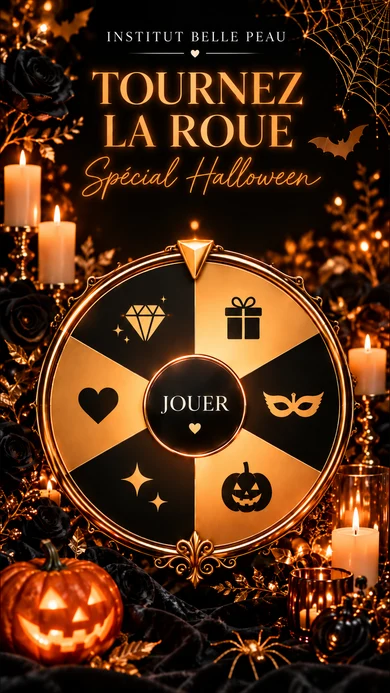
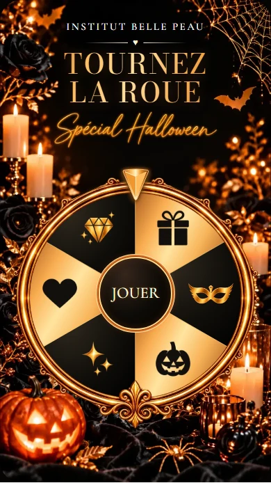

# Roue Halloween dorée — issue #456

## Référence et rendu

La référence est « Affiche Halloween dorée et raffinée.png », fournie par le propriétaire. L’image n’est pas utilisée comme une page de jeu aplatie : le logo, le titre et la vraie roue restent des éléments séparés et interactifs.

| Référence fournie | Rendu réel à 390 px |
| --- | --- |
|  |  |

### Itérations réalisées

1. Décor généré et cadre métallique transparent, roue interactive à six secteurs. Écarts relevés : pictogrammes filaires trop génériques, titre trop bas et écriture saisonnière trop différente.
2. Pictogrammes pleins/à reflets générés depuis la référence ; marge compacte du logo isolée par modèle ; titre remonté et légèrement espacé ; masque agrandi.
3. Mention saisonnière calligraphique générée comme asset fixe, sans nouvelle police à télécharger ; ajustement du dégagement avant la roue. Coordonnées SVG arrondies pour éviter une différence d’hydratation Node/Chromium.

### Correspondance estimée, non métrique automatique

| Axe | Autoévaluation | Écart résiduel |
| --- | --- | --- |
| Fond et ambiance | 9,5/10 | Les fleurs et feuillages sont régénérés, pas une copie pixel à pixel. |
| Composition et proportions | 9/10 | Le titre s’adapte au contenu réel du marchand ; un titre long allonge naturellement la page. |
| Roue et dorures | 9/10 | Volutes du cadre et facettes légèrement différentes, même traitement noir/or brillant. |
| Typographie et pictogrammes | 8,5–9/10 | Bodoni est une police déjà disponible ; les pictogrammes gardent les silhouettes de la référence avec leurs propres reflets. |
| Fidélité globale | **Environ 9/10** | Appréciation visuelle à confirmer par Pierre-Henri, pas une mesure de similarité objective. |

Différence intentionnelle demandée : aucun cœur ni autre icône dans le bouton JOUER. Le petit cœur entre les filets sous le logo appartient au décor du header, pas au bouton.

## Assets et provenance

Génération : outil intégré `imagegen`, édition guidée par la référence, transparence activée uniquement pour le cadre, les pictogrammes et le mot-symbole. Les originaux générés sont conservés hors dépôt ; les exports WebP de production sont dans `apps/web-app/public/images/templates/halloween-gold/`.

- `background.webp` : 941 × 1672, 181 874 octets. Sans texte, logo, roue ou bouton : seulement le décor photographique périphérique.
- `frame.webp` : 1254 × 1254 avec alpha, 234 198 octets. Trois filets métalliques, volutes et fleur-de-lis.
- Six pictogrammes avec alpha, dimension maximale 256 px : cadeau, masque, citrouille, étoiles, cœur, diamant.
- `wordmark.webp` : 900 × 207 avec alpha, 95 276 octets, inscription fixe « Spécial Halloween ».
- Recadrage technique, conservation de l’alpha et encodage WebP via Sharp ; aucun original utilisateur n’est modifié.

### Prompts de production reproductibles

**Fond** : portrait 9:16, reprendre le périmètre photographique noir/or de la référence, roses noires à gauche, feuillages métalliques dorés, deux bougies ambrées à gauche, bougies/votives à droite, citrouille lumineuse en bas à gauche, satin noir en bas, toile dorée en haut à droite et chauve-souris dorée sur le bord droit. Retirer tous les textes, logo, filets, cœur, roue, pointeur et ornements de roue. Garder un vaste centre noir libre pour le header et la roue. Aucune interface ni cadre circulaire dans le fond.

**Cadre** : anneau isolé sur alpha réel, face caméra, trois rails fins d’or poli avec reflets ambrés, délicates volutes baroques et fleur-de-lis en bas. Centre et extérieur transparents. Ni roue, ni secteurs, ni pointeur, ni texte, ni fond.

**Atlas** : exactement six pictogrammes, trois colonnes/deux rangées, fond transparent, chaque cellule indépendante. Première rangée : cadeau noir plein avec ruban transparent, masque de bal or métallisé avec yeux transparents et ailes effilées, citrouille noire avec visage découpé. Deuxième rangée : groupe d’éclats à quatre pointes dorés, cœur noir plein, diamant doré à facettes avec trois petits éclats. Reprendre les silhouettes de la roue de référence, pas des icônes génériques filaires. Aucun texte, cadre ou roue.

**Mention** : uniquement « Spécial Halloween », exactement ces mots et cet accent, calligraphie fine et fluide avec longues hampes, dorure ambrée lumineuse très légère, une ligne horizontale, fond alpha propre. Reprendre la mention manuscrite située sous le titre dans la référence. Aucun logo, cœur, roue ou autre décor.

## Limites et non-régressions

- Les pictogrammes sont décoratifs. Les identifiants et libellés des vrais résultats sont conservés, notamment dans la liste accessible des secteurs.
- Le rendu s’étend à un nombre pair de secteurs si six ne suffisent pas à représenter tous les résultats distincts. Aucun lot configuré ne doit disparaître pour respecter l’illustration.
- Aucun changement aux probabilités, endpoints, tirage, stock, collecte, e-mail ou retrait ; tests de session/jeu réalisés sur réponses API simulées, sans écrire en base.
- Pas de migration SQL. La petite propriété facultative `wheelTemplateStyles.*.logoBottomSpacingPx` est enregistrée dans la présentation existante pour restaurer les réglages en quittant Halloween.
- La route `/dev/halloween-proof` utilise uniquement des données fictives ; elle renvoie une page introuvable hors développement. Elle n’est pas une préproduction ni un lien de recette Vercel.
- Le serveur local 3001 n’a pas été remplacé. Le serveur temporaire 3000 sert uniquement aux vérifications et est arrêté après celles-ci.

## Vérifications réalisées

- `npm run lint` : réussi ; quatre avertissements déjà présents, hors de cette évolution.
- `npm run build` : réussi, compilation et contrôle TypeScript inclus.
- Tests unitaires de représentation des lots : 3 réussis.
- Playwright Halloween et non-régression des fonds : 20 réussis.
- Build production : fixture HTTP 404, fond WebP HTTP 200 (181 874 octets), connexion accessible sans erreur navigateur dans une session neuve.
- Serveur temporaire arrêté ; serveur 3001 conservé sans changement.

## Validation propriétaire

Créer un brouillon de roue, choisir « Halloween doré », comparer la capture à la référence, modifier le logo/titre/taille, puis revenir sur un autre template pour contrôler que ses espacements sont restaurés. Prévisualiser une campagne avec un lot de 50 %, jouer et vérifier le gain réel. Valider aussi le rendu du titre réel de l’établissement, qui peut différer du texte de démonstration.

Retour arrière : revert de la PR ; aucun changement de données métier à annuler. Les campagnes ayant sélectionné Halloween doivent être réaffectées à un modèle existant avant un retrait définitif de ce modèle.
