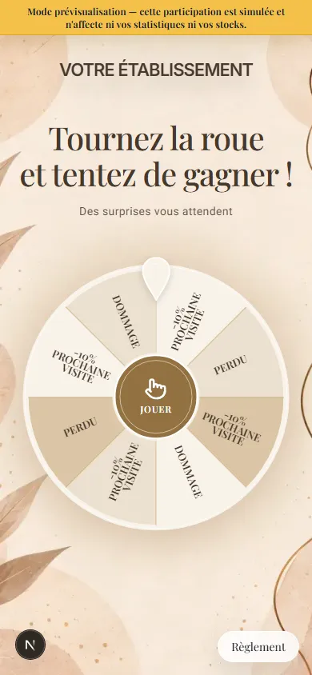
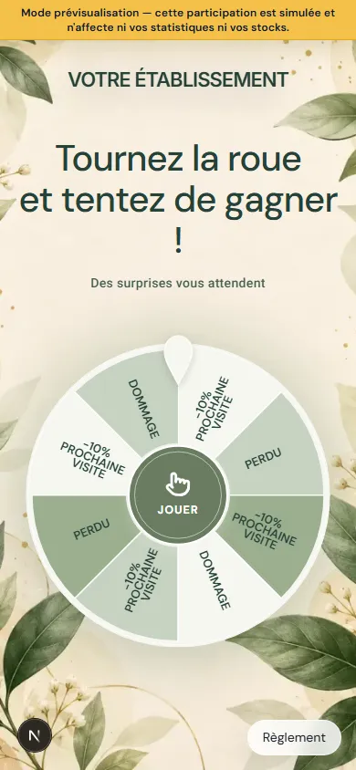

# Fonds natifs des roues beauté — issue #458

## Résultat

- **Nude & Or** reprend exactement `/images/scratch-templates/beauty-nude-elegance.webp`.
- **Botanical** reprend exactement `/images/scratch-templates/beauty-botanical-premium.webp`.
- Les aperçus, la page de jeu et les miniatures utilisent les mêmes ressources raster existantes.
- Une image choisie par le marchand (import ou bibliothèque) remplace le décor natif. Une couleur personnalisée existante reste effective.
- Le décor natif est résolu au rendu, sans enregistrer son URL comme image du marchand. Il ne se propage donc pas à un autre template.
- Aucun changement du moteur de roue, des probabilités, du parcours ou des données ; aucune migration SQL.

## Captures de vérification

Captures des composants publics réels, avec données de test, à 390 × 844 px. Le petit indicateur Next.js appartient uniquement au serveur de développement.

### Nude & Or

### Botanical

## Contrôles du 4 octobre 2026

Base : `origin/main` au commit `64cdb17db2c60e297091f3c49fc199280edc2e55`.

- `npm run lint` : succès, aucune erreur ; quatre avertissements préexistants.
- `npm run build` : succès.
- Playwright Chromium : 21 tests dédiés et 40 contrôles de non-régression (thèmes beauté, priorité des fonds manuels et Halloween), tous réussis.
- Images réellement décodées, aucun débordement horizontal à 320 et 1280 px ; vérification visuelle à 390 px.
- Build de production local : les deux ressources répondent HTTP 200 ; `/dev/beauty-wheel-backgrounds` répond HTTP 404.
- Les ressources sont déjà suivies par Git et incluses par les règles `.vercelignore` ; aucun nouveau fichier de fond à déployer.

## Recette propriétaire

1. Choisir Nude & Or puis Botanical sans fond personnalisé : vérifier les décors correspondants dans la miniature, l'aperçu intégré et la prévisualisation mobile.
2. Choisir un fond de la bibliothèque, puis un fond importé : vérifier qu'il remplace le décor natif, sans superposition végétale.
3. Changer de template sans image manuelle : vérifier que le décor Nude/Botanical ne se retrouve pas sur un autre template.
4. Vérifier que logo, titre, sous-titre et roue restent personnalisables comme auparavant.

Retour arrière : révoquer la PR ; aucun nettoyage de données nécessaire, puisque le fond natif n'est pas persisté.
