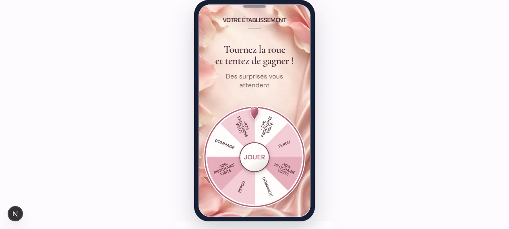
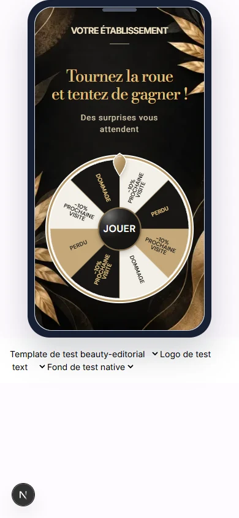
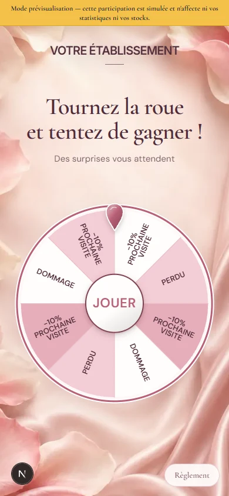
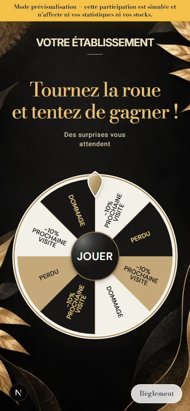
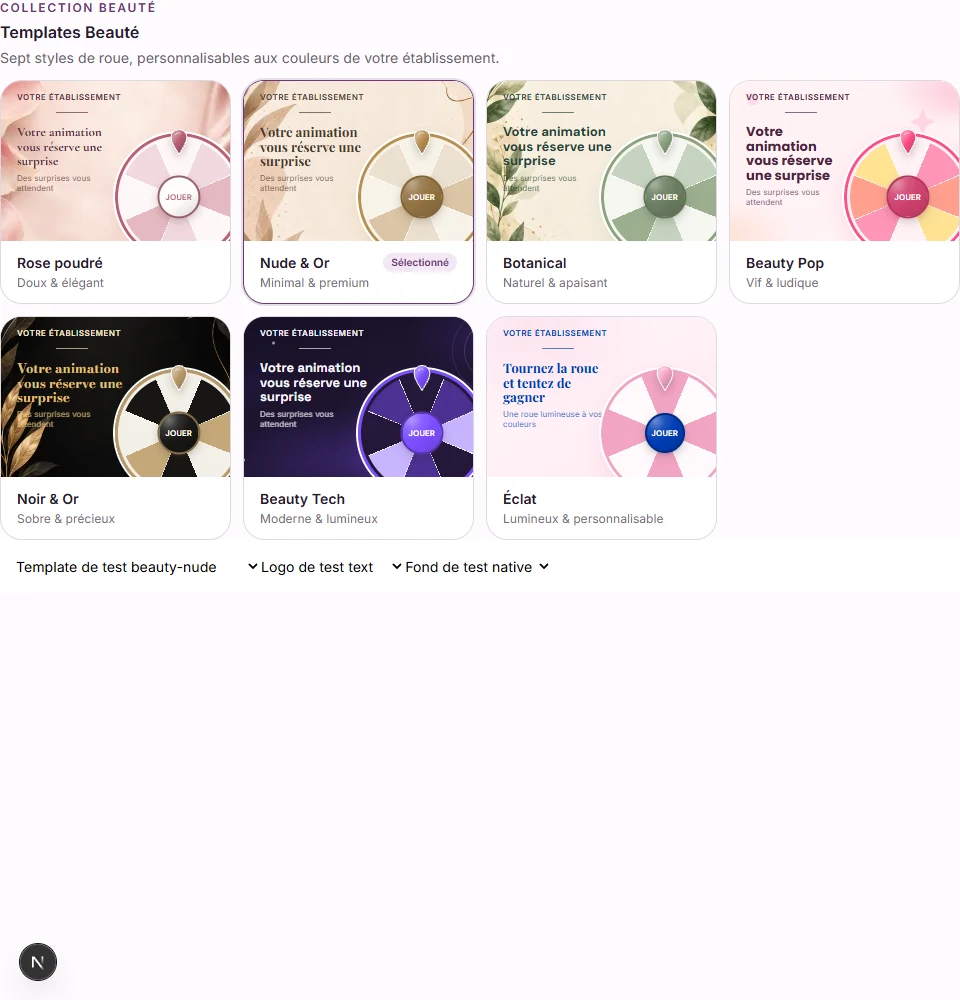

# Rose poudré et Noir & Or — #462 / #463

## Périmètre

Habillage uniquement, sur la base de la PR #461 et de son retour propriétaire. Aucun changement de handlers, de moteur, de résultat, de stock, de probabilité, de lots ni de nombre de segments. Identifiant `beauty-editorial` conservé ; aucune migration. Les réglages sauvegardés et les fonds manuels restent prioritaires.

## Références et comparaison

- [Rose poudré cible](wheel-rose-462-reference.png) : satin rose pâle, pétales sur les bords, centre crème rosé dégagé. Le fond généré reprend ces matières et ce cadrage ; les pétales sont plus grands à certains angles, sans être ajoutés sous le titre ou la roue. Les autres éléments de la capture ne sont pas demandés dans #462.
- [Noir & Or cible](wheel-noir-463-reference.png) : fond noir avec feuillages dorés, titre or, segments noir/ivoire/or, centre sombre. Le fond existant du ticket est réutilisé sans modification. Le bouton conserve DM Sans et n’a pas d’icône, conformément à #460/#461 plutôt qu’à la main visible dans la référence. Les vrais lots restent affichés.

## Images utilisées

- Nouveau fond : `apps/web-app/public/images/wheel-templates/beauty-rose-satin.webp`, 900 × 1599 px, 53 056 octets, WebP 85. Génération intégrée `image_gen`, puis réduction/encodage Sharp ; pas de reconstruction HTML/SVG du fond. Exception explicite dans `.vercelignore`.
- Fond Noir & Or : `apps/web-app/public/images/scratch-templates/beauty-noir-or.webp`, déjà versionné et inclus dans Vercel. Le ticket n’est pas modifié.

## Prompt final — génération intégrée

Use case: photorealistic-natural. Asset type: background raster only for a portrait mobile beauty wheel game, 9:16 portrait. Primary request: a premium soft blush pink satin backdrop, warm ivory-peach pale luminous center, delicate large pale pink rose petals arranged only on the outer edges and corners. Match a powder rose satin drape with silky folds and subtle sheen: flowing broad diagonal silky folds along the right border, gentle cream-pink glow across the empty center, translucent curled rose petals entering at the upper-left, mid-left, lower-left and upper-right edges, a few soft petals at the bottom edge. Materials: realistic rose petals with fine veining, soft satin fabric, refined muted powder pink tones. Lighting: very soft diffused light and gently shadowed folds, no harsh highlights. Composition: at least central 70 percent kept calm, uncluttered and pale for live text and wheel overlays; petals never in the center. Full bleed flat background, no phone, no borders, no frame, no UI. Constraints: absolutely NO text, NO logo, NO wheel, NO buttons, NO symbols, NO hearts, NO products, NO stems, NO complete flowers, NO watermark. No saturated magenta, no glitter. Generate only the actual empty satin and petal background.

## Compatibilité

L’ancien défaut Éditorial chic était un fond ivoire avec des textes sombres. Les valeurs en base ne permettent pas de distinguer ce défaut sauvegardé d’une couleur choisie volontairement. Il n’est donc pas remplacé : fond et couleurs mémorisés restent lisibles. Une nouvelle sélection sans réglages mémorisés reçoit Noir & Or. L’anneau reste personnalisable ; son défaut et le pointeur sont dorés. Les valeurs propres à chaque thème continuent d’être mémorisées/restaurées par les deux éditeurs.

## Recette propriétaire

1. Nouvelle campagne Beauté : sélectionner Rose poudré, puis Noir & Or ; vérifier les fonds, logo/titre/sous-titre et vrais lots.
2. Passer par Beauty Tech puis revenir : pas de propagation de fond ou palette.
3. Choisir une image de bibliothèque/importée : elle remplace le fond natif sur les deux thèmes.
4. Revenir à un fond couleur personnalisé : il reste effectif.
5. Ouvrir l’aperçu intégré et la prévisualisation mobile ; comparer aux captures ci-dessous.
6. Alterner logo texte/image : filet uniquement sous le texte ; JOUER sans icône, reflet, contour et ombre conservés.
7. Jouer : action marketing puis animation et résultat habituel, sans participation réelle pendant la prévisualisation.

## Captures de vérification

## Vérifications réalisées

- `npm run verify:source` : succès.
- `npm run lint` (web-app) : succès, 0 erreur / 4 avertissements préexistants hors périmètre.
- `npm run build` (web-app) : succès, TypeScript inclus.
- Chromium : 145 tests de fonds/finitions/thèmes/Halloween/non-régression + 8 tests Rose/Noir & Or + 1 contrôle de packaging, tous réussis (154 au total). Un payload incomplet dans le nouveau test unitaire a été corrigé ; les composants n’étaient pas en cause.
- Captures de la galerie et des deux pages/aperçus inspectées. Aucun pageerror dans les scénarios de rendu ; les fonds sont décodés. Les tests sont des fixtures de composants réels, sans écriture ni e-mail : ils ne remplacent pas la recette d’une campagne depuis le compte marchand sur Vercel.
- Relecture React/Next : images dimensionnées par `fill`/`sizes`, résolution native sans effet/state redondant, accessibilité du bouton et handlers inchangés, identifiants SVG uniques conservés.

### Retour arrière

Revert de la PR. Aucun SQL, aucune donnée enregistrée à restaurer.
