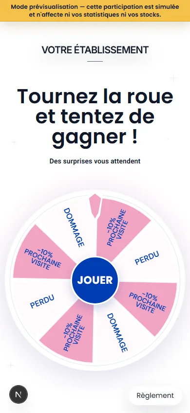
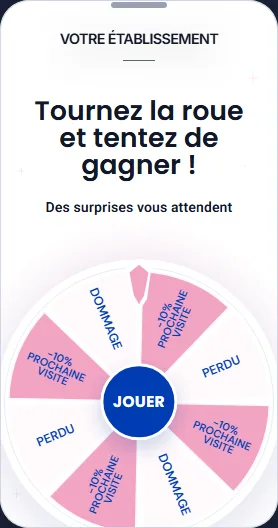
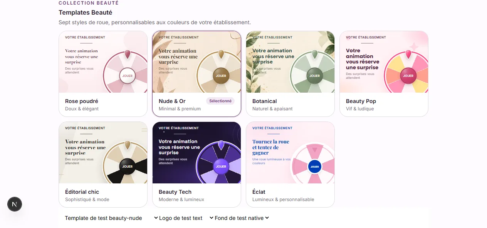

# Finitions des roues Beauté — issue #460

## Référence utilisateur

La demande concerne les finitions, pas une copie du fond ou des pictogrammes de segments : les vrais libellés de lots, les palettes et la mécanique existante restent présents.

## Choix visuels

- JOUER seul, sans main ni fleur, en DM Sans 600. Taille responsive de 16 à 27 px : réduction exacte de 1 px par rapport à la première version de la PR #461, sans diminuer les diamètres des disques centraux.
- Reflet radial discret en haut à gauche et léger modelé diagonal. Aucun filet blanc intérieur ; contour assombri de la teinte du bouton et ombre portée douce. Rose poudré garde son disque ivoire ; les autres thèmes gardent leur teinte propre et la correction de contraste existante.
- Filet de 32 × 1 px sous un logo texte, absent avec une image ou sans logo.
- Lots en DM Sans 600, déjà disponible : tailles minimales, contenu et orientation relative aux segments inchangés.
- Un seul contour coloré, renforcé de 1 px (2,5 px Nude, 3,2 px Pop, 3 px pour les autres), accompagné d'un liseré blanc extérieur de 2 px, augmenté de 1 px à la demande du propriétaire. Épaisseur stable en pixels CSS grâce au trait non redimensionné.
- Pointeur avec modelé, reflet haut-gauche, bord blanc et ombre douce pour les six thèmes `beauty-*`. Les ancrages et dimensions précédents restent inchangés. Éclat conserve son pointeur facetté antérieur à cette PR.
- Les couleurs de contour explicitement personnalisées restent prioritaires ; les contours natifs suivent l'accent du thème.

## Captures des composants publics à 390 × 844 px

Les captures utilisent des données synthétiques et les véritables composants de jeu. Le petit indicateur Next.js appartient au développement local.

| Thème | Capture |
|---|---|
| Rose poudré | [Voir](wheel-polish-460-beauty-rose-public.webp) |
| Nude & Or | [Voir](wheel-polish-460-beauty-nude-public.webp) |
| Botanical | [Voir](wheel-polish-460-beauty-botanical-public.webp) |
| Beauty Pop | [Voir](wheel-polish-460-beauty-pop-public.webp) |
| Éditorial chic | [Voir](wheel-polish-460-beauty-editorial-public.webp) |
| Beauty Tech | [Voir](wheel-polish-460-beauty-tech-public.webp) |
| Éclat | [Voir](wheel-polish-460-rose-institut-public.webp) |

## Périmètre et non-régression

Base : PR #459, commit `b83ab06`, issue #458. PR empilée, sans fusion implicite de la PR #459. Les fonds Nude/Botanical et la priorité aux images manuelles sont conservés. Aucun changement de données, moteur de jeu, probabilités, nombre de segments, tirage, action marketing, gain, e-mail ou retrait. Aucune migration ni nouvelle dépendance.

## Vérifications du 4 octobre 2026

- `npm run lint` : aucune erreur, quatre avertissements préexistants de navigation.
- `npm run build` : succès, compilation TypeScript incluse.
- Playwright Chromium : **127 tests réussis** (66 dédiés à ces finitions, 61 de non-régression sur les fonds, les thèmes, les lots et Halloween).
- Inspection des sept captures publiques, des aperçus et de la galerie : aucune icône au centre, texte JOUER non tronqué à 320/390 px, vrais lots conservés et aucune erreur de page.
- Revue React : aucun effet, callback ou état de jeu ajouté/modifié ; finitions communes, dégradés CSS légers, identifiants SVG uniques et décor non interactif.
- Serveur construit en mode production : la fixture `/dev/beauty-wheel-backgrounds` reste inaccessible (HTTP 404).

### Itération après retour sur la PR #461

Le même jour, les 127 tests sont rejoués avec succès après réduction du libellé de 1 px, suppression du filet blanc intérieur, contour assombri/ombre du centre et liseré extérieur passé à 2 px. Les sept captures et la galerie ci-dessus sont remplacées par ce dernier rendu. Les tests mesurent le delta exact de police et l'épaisseur du liseré ; lint toujours sans erreur (quatre avertissements existants). Aucun changement de dimensions, de palette ni de handlers.

## Recette propriétaire

### Exception Éclat après retour propriétaire

Les captures historiques de la première itération ci-dessus ne décrivent plus les finitions d'Éclat. Son bouton, son pointeur et son anneau sont rétablis depuis la base de la PR (`b83ab067`) : centre uni avec bord blanc de 3 px et ombre bleue d'origine, texte JOUER à graisse 700 dans la police héritée, pointeur facetté blanc/rose et anneau blanc de 18 unités SVG. La miniature retrouve également ces trois éléments. Le filet sous le logo texte et DM Sans pour les libellés de lots sont conservés ; aucune modification des six autres thèmes ou du jeu. Les tests dédiés contrôlent l'aperçu et le public à 320/390 px, les deux modes sans filet et le clic/animation/résultat. Les captures actualisées sont `wheel-polish-461-eclat-restored-public.webp`, `wheel-polish-461-eclat-restored-preview.webp` et `wheel-polish-461-gallery-restored.webp`.

1. Tester les sept thèmes, avec leurs palettes par défaut.
2. Sur les six thèmes `beauty-*`, vérifier le centre sans icône et la lueur haut-gauche, le contour blanc après l'anneau coloré et le relief du pointeur. Sur Éclat, vérifier le centre uni et son bord blanc, le pointeur facetté et l'anneau blanc antérieurs à cette PR.
3. Tester logo texte, image, puis aucun : le filet ne doit apparaître que sous le texte.
4. Vérifier les vrais lots en aperçu intégré et prévisualisation mobile, dont `-10% PROCHAINE VISITE`.
5. Tester une couleur de contour et une image de fond personnalisées.
6. Jouer en prévisualisation : même action préalable, même animation, même résultat.

Retour arrière : revert de la PR de finitions, sans SQL ni modification des réglages marchands.

### Vérification du retour arrière Éclat

Le 4 octobre 2026 : `npm run verify:source`, lint (0 erreur / 4 avertissements préexistants) et build/TypeScript réussis. Les **127 tests Chromium** sont rejoués avec succès, dont les contrôles Éclat dédiés et les non-régressions sur les autres thèmes, fonds et Halloween. Captures mobiles à 390 px inspectées :

Revue React : aucun état, effet, handler ou calcul de résultat modifié. Le décor reste non interactif ; seuls les styles ciblés et leurs preuves de test changent. Les appels API des fixtures sont interceptés, sans écriture de campagne, participation ou envoi d'e-mail. Pas de merge ni déploiement de production sans validation propriétaire.
