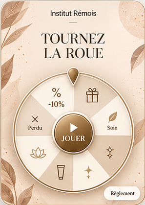
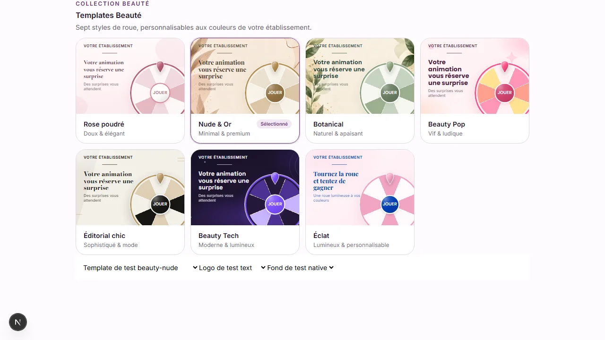

# Finitions des roues Beauté — issue #460

## Référence utilisateur

La demande concerne les finitions, pas une copie du fond ou des pictogrammes de segments : les vrais libellés de lots, les palettes et la mécanique existante restent présents.

## Choix visuels

- JOUER seul, sans main ni fleur, en DM Sans 600. Taille responsive de 17 à 28 px, sans diminuer les diamètres des disques centraux.
- Reflet radial discret en haut à gauche, léger modelé diagonal et liseré intérieur. Rose poudré garde son disque ivoire ; les autres thèmes gardent leur teinte propre et la correction de contraste existante.
- Filet de 32 × 1 px sous un logo texte, absent avec une image ou sans logo.
- Lots en DM Sans 600, déjà disponible : tailles minimales, contenu et orientation relative aux segments inchangés.
- Un seul contour coloré, renforcé de 1 px (2,5 px Nude, 3,2 px Pop, 3 px pour les autres), accompagné d'un liseré blanc extérieur de 1 px. Épaisseur stable en pixels CSS grâce au trait non redimensionné.
- Pointeur avec modelé, reflet haut-gauche, bord blanc et ombre douce. Les ancrages et dimensions précédents restent inchangés ; Éclat adopte la finition goutte.
- Les couleurs de contour explicitement personnalisées restent prioritaires ; les contours natifs suivent l'accent du thème.

## Captures des composants publics à 390 × 844 px

Les captures utilisent des données synthétiques et les véritables composants de jeu. Le petit indicateur Next.js appartient au développement local.

| Thème | Capture |
|---|---|
| Rose poudré | [Voir](wheel-polish-460-beauty-rose-public.webp) |
| Nude & Or | [Voir](wheel-polish-460-beauty-nude-public.webp) |
| Botanical | [Voir](wheel-polish-460-beauty-botanical-public.webp) |
| Beauty Pop | [Voir](wheel-polish-460-beauty-pop-public.webp) |
| Éditorial chic | [Voir](wheel-polish-460-beauty-editorial-public.webp) |
| Beauty Tech | [Voir](wheel-polish-460-beauty-tech-public.webp) |
| Éclat | [Voir](wheel-polish-460-rose-institut-public.webp) |

## Périmètre et non-régression

Base : PR #459, commit `b83ab06`, issue #458. PR empilée, sans fusion implicite de la PR #459. Les fonds Nude/Botanical et la priorité aux images manuelles sont conservés. Aucun changement de données, moteur de jeu, probabilités, nombre de segments, tirage, action marketing, gain, e-mail ou retrait. Aucune migration ni nouvelle dépendance.

## Vérifications du 4 octobre 2026

- `npm run lint` : aucune erreur, quatre avertissements préexistants de navigation.
- `npm run build` : succès, compilation TypeScript incluse.
- Playwright Chromium : **127 tests réussis** (66 dédiés à ces finitions, 61 de non-régression sur les fonds, les thèmes, les lots et Halloween).
- Inspection des sept captures publiques, des aperçus et de la galerie : aucune icône au centre, texte JOUER non tronqué à 320/390 px, vrais lots conservés et aucune erreur de page.
- Revue React : aucun effet, callback ou état de jeu ajouté/modifié ; finitions communes, dégradés CSS légers, identifiants SVG uniques et décor non interactif.
- Serveur construit en mode production : la fixture `/dev/beauty-wheel-backgrounds` reste inaccessible (HTTP 404).

## Recette propriétaire

1. Tester les sept thèmes, avec leurs palettes par défaut.
2. Vérifier le centre sans icône et la lueur haut-gauche, le contour blanc après l'anneau coloré et le relief du pointeur.
3. Tester logo texte, image, puis aucun : le filet ne doit apparaître que sous le texte.
4. Vérifier les vrais lots en aperçu intégré et prévisualisation mobile, dont `-10% PROCHAINE VISITE`.
5. Tester une couleur de contour et une image de fond personnalisées.
6. Jouer en prévisualisation : même action préalable, même animation, même résultat.

Retour arrière : revert de la PR de finitions, sans SQL ni modification des réglages marchands.
